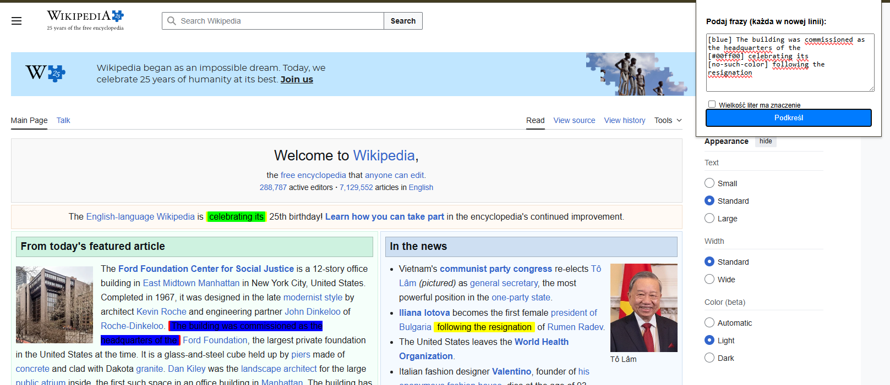

# Quick Highlighter (Chrome Extension)

A lightweight, developer-friendly Chrome extension to highlight multiple phrases on any webpage simultaneously with custom color support via a simple markup language.

## 🚀 Features

- **Multi-line Highlighting:** Paste multiple phrases (one per line) to highlight them all at once.
- **Color Customization:** Use simple tags like `[red]` or HEX codes like `[#4287f2]` to specify colors.
- **Smart Validation:** Built-in validation for colors with a safe fallback to yellow.
- **Whole Word Matching:** Prevents partial matches (e.g., highlighting "cat" inside "category").
- **Case Sensitivity Toggle:** Option to match exact casing or ignore it.
- **DOM Safe:** Uses the `TreeWalker` API to modify text nodes without breaking website functionality or scripts.

## 🛠 Installation

Since this is a developer-centric MVP, follow these steps to load it manually:

1. **Download/Clone** this repository to a local folder.
2. Open Google Chrome and navigate to `chrome://extensions/`.
3. Enable **"Developer mode"** using the toggle in the top-right corner.
4. Click the **"Load unpacked"** button.
5. Select the folder containing the extension files.

## 📖 How to Use

1. Click the **Quick Highlighter** icon in your browser toolbar.
2. Enter the phrases you want to find.
3. (Optional) Use color tags at the beginning of a line:
   - `[blue] This phrase will be blue`
   - `[#ff5733] This phrase uses a custom HEX color`
   - `Standard text without tags` (defaults to yellow).
4. Choose whether you want **Case Sensitive** matching.
5. Click **"Highlight"**.

> **Note:** Highlights are transient. Refresh the webpage if you wish to clear them.

## 🎨 Supported Colors

- **Named colors:** `red`, `green`, `yellow`, `blue`, `violet`.
- **HEX codes:** Any valid format like `[#FFF]` or `[#000000]`.
- **Fallback:** Any invalid color tag defaults to `yellow`.

## 📂 Project Structure

- `manifest.json`: Extension configuration (V3).
- `popup.html`: The UI layout.
- `popup.js`: Input parsing and script injection logic.
- `styles.css`: Defines the visual look of the highlights.